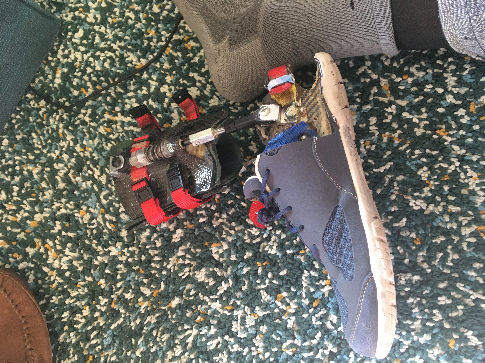
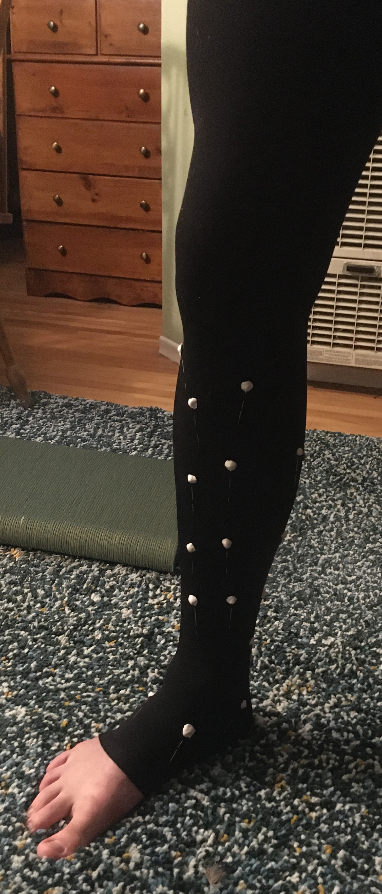

# Exoskeleton

## v0

Initial proof of concept

## v1

*Caption: Alternate view of version 2 shoe design.*

## In Action (Cropped)
<video src="inaction_cropped.mp4" autoplay loop muted controls></video>
Field testing

*The floor workshop.*

## v2

## Scan
<video src="leg.mp4" autoplay loop muted controls></video>
*Caption: Captured motion of the leg.*

The 3D scan